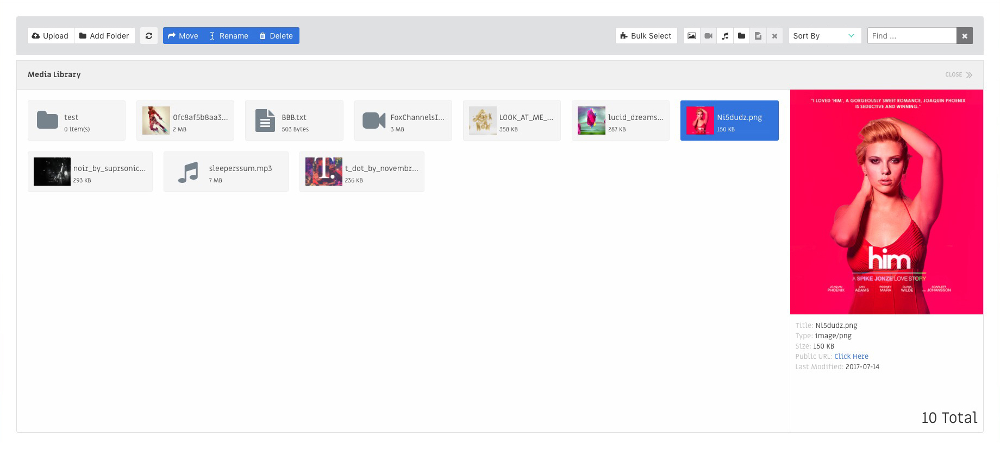

# Laravel Media Manager



## Intro

- Inspired by [Voyager](https://github.com/the-control-group/voyager), [October](https://github.com/octobercms/october), [WordPress](https://codex.wordpress.org/Media_Library_Screen)
- Built using
    + [Vue](https://vuejs.org/)
    + [jQuery](https://jquery.com/)
    + [dropzone](http://www.dropzonejs.com/)
    + [keycode](https://github.com/timoxley/keycode)
    + [jquery.scrollTo](https://github.com/flesler/jquery.scrollTo)
    + [vue-tippy](https://github.com/KABBOUCHI/vue-tippy)
    + [vue2-filters](https://github.com/freearhey/vue2-filters)
    + [vue-lightbox](https://github.com/phecko/vue-lightbox)
    + [bootstrap modal](http://getbootstrap.com/javascript/#modals)
    + [notification-component](https://github.com/ctf0/Notification-Component)
    + [Ziggy](https://github.com/tightenco/ziggy)

- to optimize uploaded files on the fly try [approached](https://github.com/approached/laravel-image-optimizer) or [spatie](https://github.com/spatie/laravel-image-optimizer)

- package requires Laravel v5.4+

## Installation

- `composer require ctf0/media-manager`

- add the service provider to `config/app.php`

```php
'providers' => [
    ctf0\MediaManager\MediaManagerServiceProvider::class,
]
```

- publish the package assets with

`php artisan vendor:publish --provider="ctf0\MediaManager\MediaManagerServiceProvider"`

- run `php artisan mm:append` to
    + add package routes to `routes/web.php`
    + add package assets compiling to `webpack.mix.js`
    + add `MIX_MM_FRAMEWORK=bulma` to `.env`

## Features

- multi
    - upload
    - move
    - delete
- bulk selection.
- auto scroll to selected item when using (left, right, home, end)
- search
- filter by type
    + folder
    + image
    + audio
    + video
    + text
- sortBy
    + name "default"
    + size
    + last modified
- items count for
    + all
    + selected
    + search found
- protection against overwriting (files / folders)
- file name sanitization for
    + upload
    + rename
    + new folder
- disable/enable buttons depend on the usage to avoid noise & keep the user focused
- shortcuts

    |      navigation     |            button           |  keyboard |    mouse     |
    |---------------------|-----------------------------|-----------|--------------|
    |                     | upload *(toolbar)*          | u         |              |
    |                     | refresh *(toolbar)*         | r         |              |
    |                     | move *(toolbar)*            | m         |              |
    |                     | delete *(toolbar)*          | d/del     |              |
    |                     | bulk select *(toolbar)*     | b         |              |
    |                     | bulk select all *(toolbar)* | a         |              |
    |                     | toggle *(sidebar)*          | t         | click        |
    |                     | file rename *(modal)*       | enter     |              |
    |                     | file delete *(modal)*       | enter     |              |
    |                     | create new folder *(modal)* | enter     |              |
    | select next         |                             | right     |              |
    | select prev         |                             | left      |              |
    | selct first         |                             | home      |              |
    | select last         |                             | end       |              |
    | open folder         |                             | enter     | double click |
    | go back to prev dir | folderName *(breadcrumb)*   | backspace | click        |
    | play/pause          | player controller           | space     |              |
    | view image          | sidebar image               | space     | click        |
    | hide image          |                             | space/esc | click        |

## Config
**config/mediaManager.php**

```php
return [
    /*
     * ignore files pattern
     */
    'ignore_files' => '/^\..*/',

    /*
     * filesystem disk
     */
    'storage_disk'=> 'public',

    /*
     * remove any file special chars except (. _ -)
     */
    'allowed_fileNames_chars'=> '.\_\-',

    /*
     * remove any folder special chars except (_ -)
     */
    'allowed_folderNames_chars'=> '\_\-',

    /*
     * disallow uploading files with the following mimetypes
     * https://svn.apache.org/repos/asf/httpd/httpd/trunk/docs/conf/mime.types
     */
    'unallowed_mimes' => ['php', 'java'],

    /*
     * when file names gets cleand up
     */
    'sanitized_text'=> 'sanitized',

    /*
     * css farmework
     * ex.
     * MIX_MM_FRAMEWORK=bulma
     */
    'framework' => env('MIX_MM_FRAMEWORK'),
];
```

## Usage

#### - Simple
- visit `http://127.0.0.1:8000/media`
- open `views/vendor/MediaManager/bulma/media.blade.php` and make any changes you may need.
    + if you need to use different css framework ex."bootstrap", you'll have to edit the components as well.

#### - Advanced
- install javascript dependencies

```bash
yarn add vue dropzone keycode vue-tippy vue2-filters vue-lightbox vuemit
# or
npm install vue dropzone keycode vue-tippy vue2-filters vue-lightbox vuemit
```

- for styling we use ***bulma***

> ***Or Use another Framework***
>
> - duplicate `views/vendor/MediaManager/bulma` and rename it to the framework you want ex.`bootstrap`
> - duplicate `assets/vendor/MediaManager/js/components/bulma` and rename it to the framework you want ex.`bootstrap`
> - duplicate `assets/vendor/MediaManager/sass/bulma` and rename it to the framework you want ex.`bootstrap`
> - set `MIX_MM_FRAMEWORK` to the framework name ex.`MIX_MM_FRAMEWORK=bootstrap`
> - start editing the new files.
> - run `npm run watch` to compile your `js/css` files.
>
> after you are done, maybe you can send me a PR so everyone else can benefit from it :trophy:

- at last, simply add this one liner to your main js file

```js
require('./../vendor/MediaManager/js/media')

new Vue({
    el: '#app'
})
```

## ToDo "ANY HELP IS APPRECIATED"

* [ ] Add Support To Other Css Frameworks.
* [ ] Add Support For Editors usage "tinymce / Ckeditor/ etc".
* [ ] Fix `sortBy:size` To Work Properly With (kb vs Mb).
